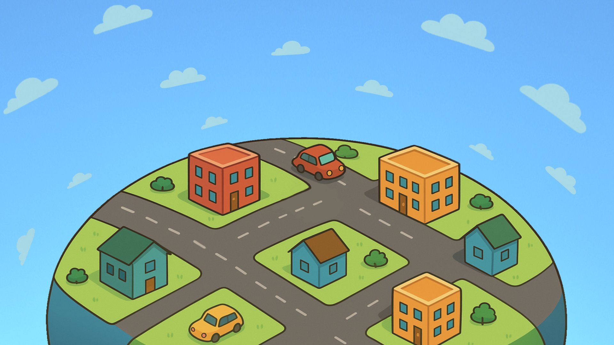

# 🏘️ HashCity - Interaktives Lernen von Hashverfahren

Willkommen in **HashCity**!
Dieses Projekt ist eine gamifizierte Webanwendung, die entwickelt wurde, um Studierenden die Funktionsweise von Hashmaps, Hashfunktionen und Kollisionsstrategien spielerisch näherzubringen.

## 🎯 Über das Projekt

Hashmaps sind eine fundamentale Datenstruktur in der Informatik. Sie bieten viele Vorteile um die Speicherung großer Datenmengen effektiver zu machen. Jedoch haben auch sie einige Probleme, welche gelöst werden müssen. Konzepte wie "Rehashing", "Linear Probing" oder "Quadratic Probing" können zunächst sehr verwirrend wirken.

**HashCity** verwandelt diese Konzepte in eine Stadt-Simulation:
* **Häuser** repräsentieren die Speicherplätze (Buckets).
* **Bewohner** sind die Datensätze (Keys).
* **Major Mike**, der Bürgermeister, führt den Spieler durch verschiedene Levels.

Ziel ist es, alle Bewohner effizient in ihre Häuser einziehen zu lassen und dabei Kollisionen (wenn zwei Bewohner in dasselbe Haus wollen) mit verschiedenen Strategien zu lösen.

## 🚀 Features & Lerninhalte

Das Spiel ist in aufeinanderfolgende Levels unterteilt, die jeweils ein spezifisches Konzept behandeln:

* **Grundlagen:** Wie funktioniert eine Hashfunktion? (Modulo-Operator)
* **Kollisionen:** Was passiert, wenn ein Platz schon belegt ist?
* **Linear Probing:** Die Suche nach dem nächsten freien Platz.
* **Quadratic Probing:** Vermeidung von primären Clustern durch quadratische Sprünge.
* **Double Hashing:** Nutzung einer zweiten Hashfunktion für die Schrittweite.
* **Load Factor & Rehashing:** Wann ist die Stadt zu voll? Wie vergrößern wir die Tabelle effizient?
* **Separate Chaining:** Mehrfamilienhäuser als Lösung (Listen in Buckets).

## 🛠️ Technologien

Das Projekt ist bewusst leichtgewichtig gehalten, um einfach deployt und verstanden zu werden:

* **Frontend:** HTML5, CSS3, JavaScript (jQuery)
* **Backend:** PHP (für die Level-Logik und Asset-Verwaltung)
* **Styling:** Bootstrap 5 & Google Fonts (Orbitron, Rajdhani)
* **Assets:** SVG-Grafiken für skalierbare, scharfe Darstellung

## 🎮 Wie man spielt

1.  Starte auf der **Level-Auswahl**.
2.  Wähle ein Level (beginnend bei Level 0).
3.  Folge den Anweisungen von **Major Mike**.
4.  Nutze den **Hash-Rechner** im Info-Panel, um die Hausnummern für die Bewohner zu ermitteln.
5.  Klicke auf die entsprechenden Häuser, um die Bewohner einziehen zu lassen.
6.  Löse Kollisionen je nach Level-Vorgabe (z.B. durch Berechnen einer Sprungweite).

